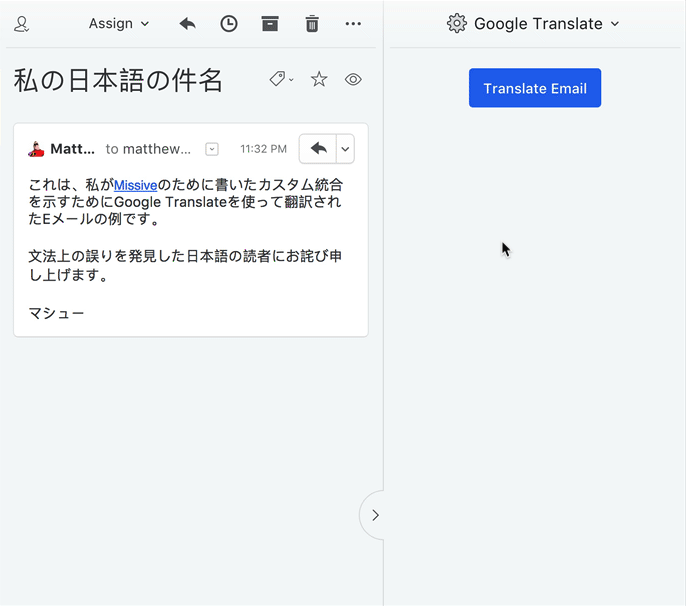

# Google Translate Integration for Missive

If you haven't heard of it before, [Missive](https://missiveapp.com) is a life-changing email client that doubles as a powerful help desk for individuals or teams. 

One of the many nice features Missive allows is "Custom Integrations" - effectively you can enhance Missive with custom tools to suit your workflow.

I develop mobile apps and receive emails from users all over the world - many not in English. So ... this is my attempt at a quick "hack" to enable a way of translating these emails right from inside Missive. And it works great!

 

## How the Integration Works

The Plugin will load all the required JS and CSS and default to showing the "Translate" button. You will need to press this "Translate" button to trigger the translation. It was designed this way so that unncessary API calls are not made to the Google Translate API.

When you press the "Translate" button, it will use the [Google Cloud Translation API](https://cloud.google.com/translate/docs/reference/rest) to translate both the email subject line and the email body of the most recent message in the email thread. 

You can also translate each email in the message thread via the action menu, see demo above.

Once the translation is complete you will see:

1. The translated email **subject**.
2. The translated email **body**.
3. The detected **language** of the email body.

You then have the option of:

1. Saving the translated email to the conversation using the "Add to Conversation" button. 
    * This takes advantage of a fantastic feature in Missive, and means that you don't need to translate the email again.
2. Translating a reply email using the "Reply" button. 
    * This will open a new browser window with Google Translate preset with the correct source and target languages. This only works on the desktop at the moment - I will talk with Missive about creating a way to call external urls on iOS etc.  

## Getting Started

To use Google Translate, you need your own valid API key. You need a valid [Google Cloud Project](https://cloud.google.com/translate/docs/quickstart-client-libraries), and once you find your way to the "Credentials" section, you need to generate an API key. Make sure it is an "API key" and not a "Service account key" or one of the other options. I won't step through this process as to be honest I found it quite painful and it is explained elsewhere.

Once you have the API key, follow these steps.

1. Grab a copy of the [translator.htm](translator.htm) page and store it on a server somewhere. 
   * It is a static page so there are no special requirements, other than Missive requiring the address to start with `https://`.
2. Open Missive > Settings > Integrations > Add Custom Integration.
3. Enter in the custom name, eg: "Google Translate".
4. Enter in the URL from step 1, plus the API key (see example below).
5. Optionally add an image for the integration.

The minimum URL for the integration is:
  
  `https://example.com/missive/translator.htm?key=YOUR_API_KEY_FROM_GOOGLE`

#### Additional Translation Options

Additional settings can optionally be defined in the URL.

* `sl` - Source Language. If you leave this blank it will auto-detect the language used in the email.
* `tl` - Target Language. If you leave this blank it will default to English (en).

Here is an example where we want all the emails translated to French:

  `https://example.com/missive/translator.htm?tl=fr&key=YOUR_API_KEY_FROM_GOOGLE`
  
You can see all the language codes supported [here](https://cloud.google.com/translate/docs/languages).

## Localisation

By default all the UI elements are in English. But it would be a shame for a translation plugin to not support some way of localising the strings in other languages!

To customise the strings used, these can be overridden in the url.

|        key      |  default string     |
|-----------------|---------------------|
|`strLoading`     | Loading...          |
|`strTranslate`   | Translate           |
|`strTranslating` | Translating...      |
|`strConversation`| Add to Conversation |
|`strReply`       | Reply               |

Here is an example where the Translate button label is changed from "Translate" to "Translate Now":

  `https://example.com/missive/translator.htm?strTranslate=Translate%20Now&key=YOUR_API_KEY_FROM_GOOGLE`
  
---
  
The code is not perfect, but it was fun for me to experiment with, and it works really well. 

I imagine that Missive will release their own official Google Translate plugin one day, but in the meantime I hope this proves useful to you as well :)

All the best.